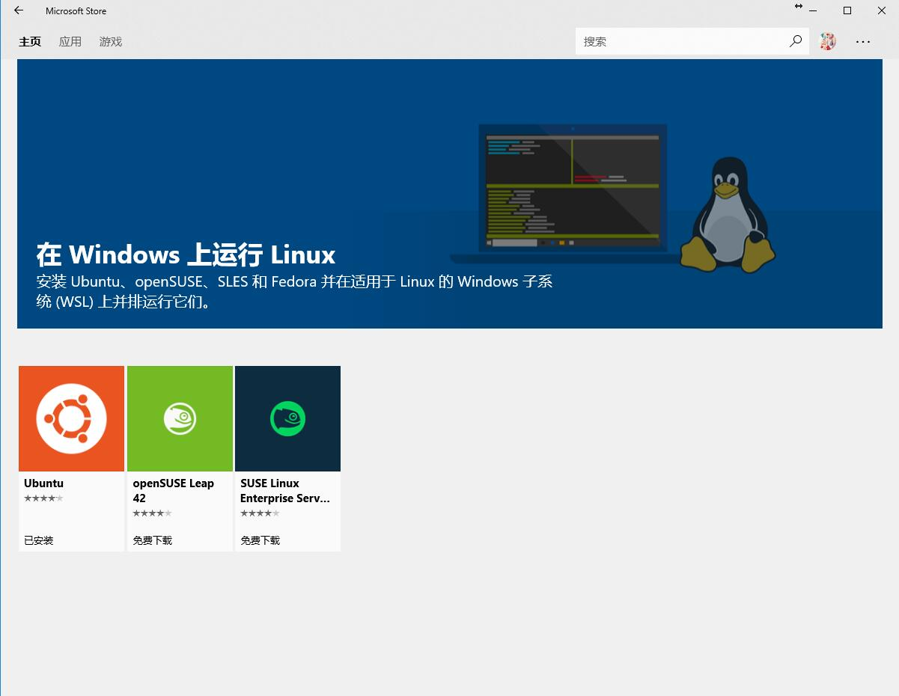
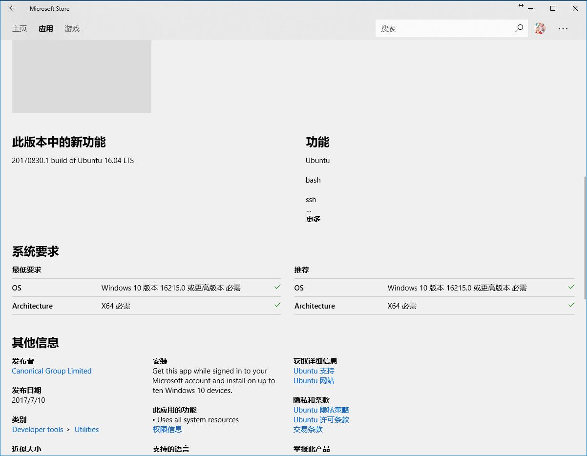
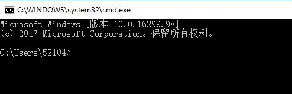
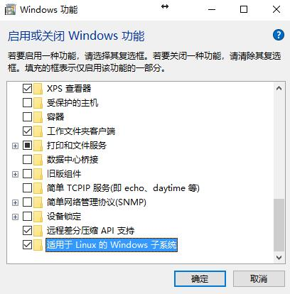
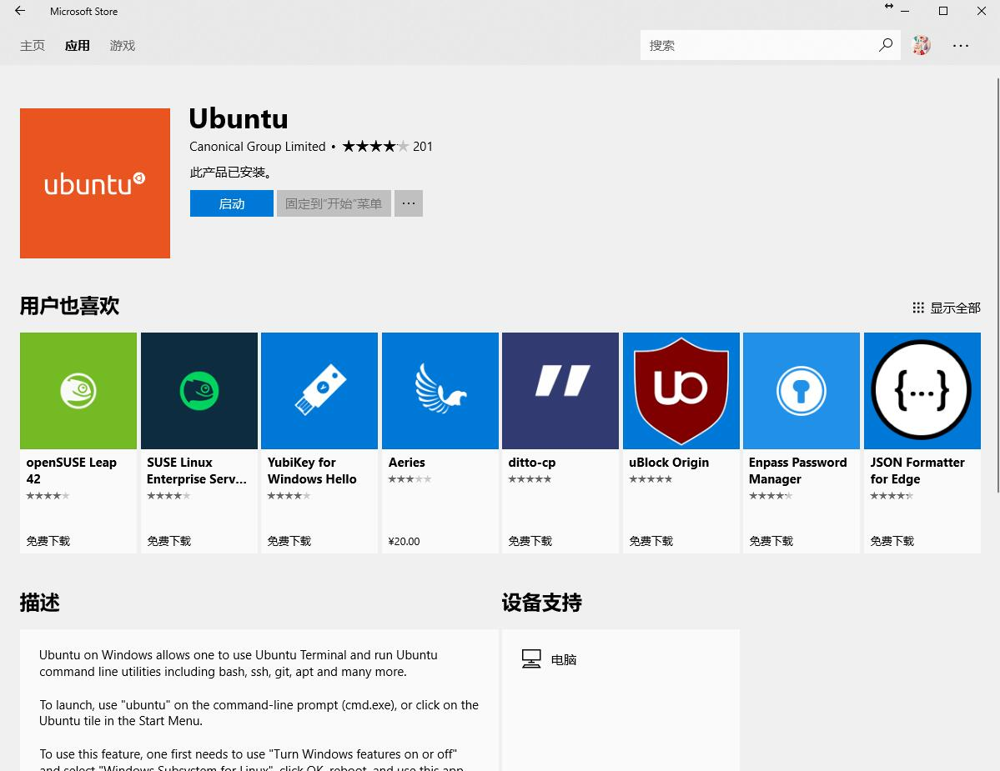
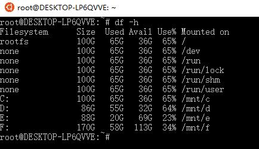
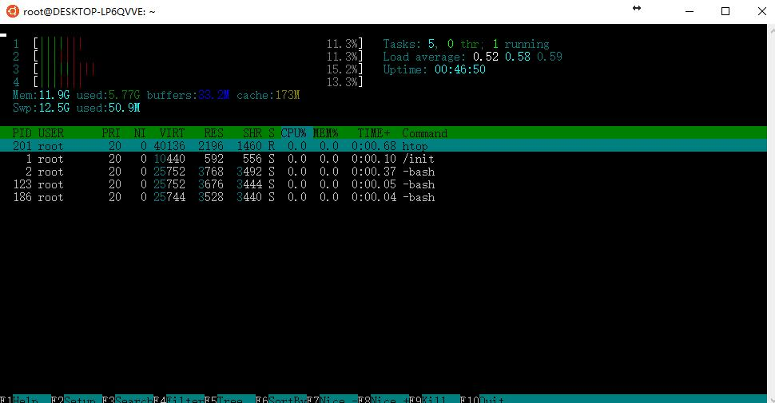

# 前言

早在 win10 刚出的时候就流传着 win10 可以直接运行 linux 程序的传言，顿时让人觉得吊炸天，Win10 逆袭。 然而，win10 真正出来后，这个功能被推迟了，直到最近才真正的大范围推出。

win10 下的 linux 子系统并没有图形界面，只是一个黑框框，有期待使用 linux 图形界面的可能要失望了，这个版本应该更针对于专业的计算机人员。

那么怎么开启这个功能，我这篇文章来介绍一下。

# 为何要学linux

这个问题，[知乎](https://www.zhihu.com/question/20117703) 上随便一搜就是一大堆。在这里我只谈谈自己的想法。

Linux 学习成本比 windows、MacOs 高很多，你需要熟悉很多很多的命令。我本来不觉得学这么一个难学的东西有什么必要性，但是后来发现，linux 系统对内存的占用极少，一个centos系统，在没有开启图形桌面的情况下开机，内存占用只是几十兆级别的，而且很多软件占用的内存都比 windows 小很多。

当前云服务很流行，学习计算机的同学很多都可以买一个最低配的云服务器，做一个个人的主页，放一些学习心得，小的项目啥的。而云服务器来说，最低配的`1核1G`跑 `windows server` 还是有些吃力的，而使用 linux 运行一个小型网站，则是绰绰有余！

学习计算机肯定要投入全球最大的同性交友平台，要学会查找使用改进开源框架，通过阅读使用优秀的人的代码来提升自己，通过站在巨人的肩膀上让自己的学习道路事半功倍。很多情况下，我们需要根据自己看上的框架去学习各种各样的知识。例如：为了学习使用 WebGL ，我学习使用了 three.js 库，并且逼自己学会使用了 JavaScript 语言， HTML语言， bootstrap库， tomcat服务器程序。

我们要不停的接触新的东西，来维持自己的好奇心，来让自己不被时代淘汰就要了解时代最前沿的工具。当前 linux 作为服务器常用系统，必定有其优越性，我们即便自己以后不一定负责服务器的运维，但对这些操作要有基础的了解才是。

这是我心中所想，学习 linux 并不是终点，而是自己广阔的学习道路上的一个插曲，我们要开阔自己的视野，了解学习尽可能多的东西。

# 确定系统版本
首先确定自己的系统版本是否满足要求。

根据微软应用商店里的描述，需要是 16215.0 以上的系统版本。而据我的测试，1703版本是不支持的，而最新的1709版本支持。你可以使用`Win + R`，调出运行窗口，然后键入 `cmd` 确定，打开命令行窗口，这里能够看到版本信息。

如果自己的系统不满足要求，可能需要更新系统，要么等待微软的推送，要么手动更新。这里我只给大家一个提示，使用 [ Win10更新助手 ](https://support.microsoft.com/zh-cn/help/3159635/windows-10-update-assistant) [ 下载地址 ](https://www.microsoft.com/zh-cn/software-download//windows10) 可以手动更新到最新版本，并且可以下载最新的系统镜像文件，想要制作系统盘的同学也可以试一试。

不过，最新的 Win10 有很多改进，但也不是完全没问题，我就遇到了一个奇怪的bug，每次刚开机时要输入两次密码才能进入到桌面。。。。

# 安装方法

在真正可以用之前，我们需要启用 WSL功能(Windows subSystem Linux)，这里我们使用搜索功能，搜索 `启用或关闭Windows功能`， 然后找到最下面`适用于 Linux 的 Windows 子系统`，将其勾选，然后可能需要重新启动。

当这一步做好了后，我们打开win10 的应用商店，在里面搜索 `linux`，然后会有 `在 Windows 上运行 Linux` 专题。我们打开专题选择自己需要的系统即可像安装一般 win10 应用一样的安装这个子系统。

# 安装完成

之后我们便可以启动这个子系统。里面可以正常使用 ubuntu 的大部分功能。还可以自己下载安装些东西玩。但系统默认安装在C盘，无法更改位置，比较麻烦，因此如果在子系统上安装过多的文件，可能会导致C盘爆满（不过一般 linux 程序也不是很大就是了）。

## Tips
- 子系统是直接的root账号，没有密码。
- ubuntu 系统中可以访问到 win 的硬盘，路径是 `/mnt/盘符` 例如：D盘的路径是 `/mnt/d`。
    
- htop 非常好用，可以使用 `apt-get install htop` 进行安装，可以查看到 linux 运行了多少程序，并且可以管理进程，非常方便
    
