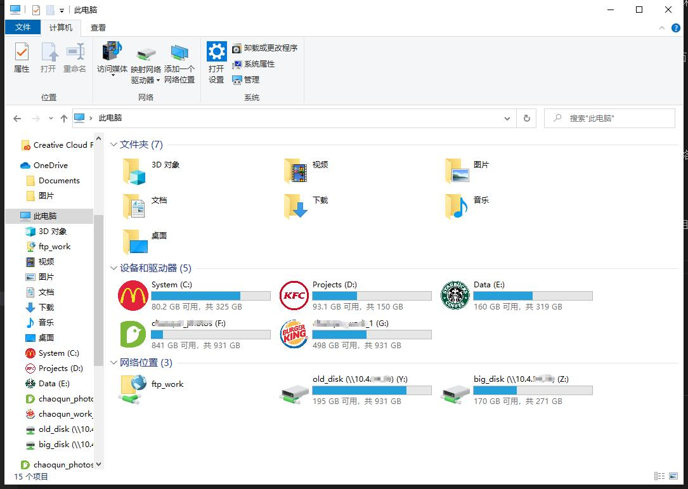

我一直有个想法：等毕业后租房子后，淘一些二手服务器、交换机、机架，自己在家里搞一个私有云，私有云需要准备一些文件存储服务器，用于支持 KVM 热迁移或者是自己的一些数据备份。

## NAS 是啥

NAS （Network Attached Storage）泛指网络附加存储，也就是一个存储服务器，你的多台设备可以通过网络连接到该服务器，读取里面的文件、往里面写入文件。最理想的状态下，NAS 的文件读写速度应该与本机的存储无太大差距，不过这可能需要读写速度更快的存储服务器和超过 10Gbps 的内网带宽。

## NAS 的原理

NAS 原理很简单，便是一个存储服务器，通过特殊的协议与其他终端设备共享存储空间。常见的NAS协议如下：

* 网络文件系统 (NFS)：该协议是 Linux 和 UNIX 系统的常用协议。作为一个供应商中立型协议，NFS 适用于所有硬件、操作系统或网络架构。
* 服务器消息块 (SMB)：大多数使用 SMB 的系统运行的都是 Microsoft Windows，该协议在 Windows 中被称为“Microsoft Windows 网络”。SMB 是基于通用互联网文件共享 (CIFS) 协议开发的，所以它也被称为 CIFS/SMB 协议。
* Apple 文件传输协议 (AFP)：运行 macOS 的 Apple 设备的专有协议。

## 如何 DIY 一个简易的 NAS 系统

网络上大多数 DIY NAS 的方法便是在 linux 服务器下安装 samba 相关的的软件，配置一个可以与 windows 共享的文件共享协议。而且，支持 SMB 协议的不只是 Windows 操作系统，安卓、苹果等都可以通过安装一些文件管理 app 来实现访问 SMB 协议的 NAS。

我也在自己的工作站上安装了 SMB 和 FTP 服务，通过千兆路由器与自己的笔记本连接，并将其挂载为网络位置，可以很方便的在计算机中访问到他，并且访问速度可以达到逼近 100 M/s 的传输速度。

## 常见的 NAS 系统

但上述的 DIY 方式其实很简陋，需要修改配置都需要在 NAS 服务器上手动调整，事实上也存在很多种专门的 NAS 操作系统。

* 群晖：群晖算是国产之光了，他的 NAS 操作系统非常的好用，被广大网友评价 “买系统送硬件” 但该系统只能用于群晖自己的 NAS 服务器，用于其他服务器需要破解且不够稳定；
* FreeNAS：FreeNAS基于FreeBSD系统开发，是现在最受欢迎的开源NAS系统之一，官方文档很全而且中文教程也很多。不过FreeNAS基于ZFS文件系统，只支持64位CPU，最小内存要求8GB，对硬件的要求比较高，主要面向企业级用户。
* OpenMediaVault：OMV是基于Debian的开源NAS系统。我比较熟悉Linux，所以更倾向于OMV。它本身就有很多插件，还有很多第三方的插件可以安装。如果想自己扩展其它功能（比如Aria2）的话也很方便，和其它Linux系统一样。OMV还有树莓派的版本，感兴趣的话可以下载试试。
* NAS4Free：NAS4Free是基于FreeNAS开发的，可以算是FessNAS的一个分支，最近更名为了 XigmaNAS。它对硬件的要求比较低，适合家用。不过文档和教程不多。

## Reference

1. [KVM实战：原理、进阶与性能调优](https://item.jd.com/12558300.html)
2. [自己动手搭 NAS](https://my.oschina.net/u/3757085/blog/1928642)
